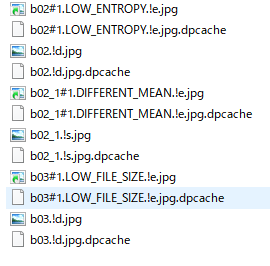
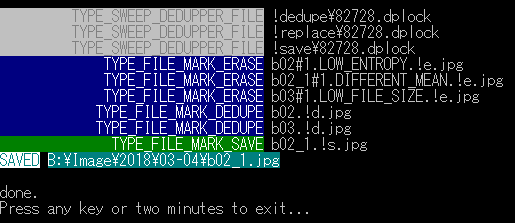

[![Windows build status][1]][2]
[](https://codecov.io/gh/wkdhkr/dedupper)
[](https://codeclimate.com/github/wkdhkr/dedupper/maintainability)

[1]: https://ci.appveyor.com/api/projects/status/github/wkdhkr/dedupper?branch=master&svg=true
[2]: https://ci.appveyor.com/project/wkdhkr/dedupper/branch/master

Importing a lot of files while eliminating duplication. Currently, this application focuses on image files. Even video files can be used as it is (file hash only).

Dedupper uses the current time date in the file path. You do not have to worry about flooding files in one directory.

## Key features

* duplicated image detection([pHash](https://www.phash.org/), [dHash](http://www.hackerfactor.com/blog/?/archives/529-Kind-of-Like-That.html), imageMagick signature)
* SQLite integration(Even if you delete a file, the hash will not be lost from SQLite DB.)
* Examine files that are suspected of duplication.
* nsfw image filtering by [Open nsfw model](https://github.com/yahoo/open_nsfw)
* face of gender/age image filtering by [rude-carnie](https://github.com/dpressel/rude-carnie)
* suggest same image of higher quality

## How it works

1.  Gather information on files. (Resolution, hash value, file size, etc.)
1.  Check if there is anything already gotten. To eliminate duplication.
1.  Duplicate suspected files are compared and judged in detail.
1.  In addition, machine learning can also reject images that do not meet the criteria.
1.  No problem new files will be imported, delete duplicate files or leave the final decision to the user.
1.  Files judged to be better may be replaced with existing files.

## Setup

### Dedupper

* only support Windows 10 x64.

```bash
choco install imagemagick --version 7.0.7.6 -y
choco install ffmpeg --version 3.4.2 -y
npm install --global --production windows-build-tools
git clone https://github.com/wkdhkr/dedupper.git
cd dedupper
npm install
npm run build
npm link
deactivate
```

### Deep learning

#### Cuda, cuDNN

If you use tensorflow-gpu, following is required.

* Cuda 9.0
  * [CUDA Toolkit 9.0 Downloads | NVIDIA Developer](https://developer.nvidia.com/cuda-90-download-archive?target_os=Windows&target_arch=x86_64&target_version=10&target_type=exenetwork)
  * copy `bin/ include/ lib/` folder to `C:\Program Files\NVIDIA GPU Computing Toolkit\CUDA\v9.0`
* [cuDNN Download | NVIDIA Developer](https://developer.nvidia.com/rdp/cudnn-download)

#### Python 3

install miniconda for setup tensorflow etc.

* `choco install miniconda3 -y`

You can choose either tensorflow or tensorflow-cpu.(recommend: tensorflow. use gpu.)

**NOTE:** activate command is not work in Powershell. try `conda install -n root -c pscondaenvs pscondaenvs`.

**NOTE:** Just install miniconda when using yaml file. pip/conda install is not needed.

manual install version.

* Miniconda with Python 3.6
  * Tensorflow 1.5(GPU)
    * `conda create -n tensorflow python=3.6 anaconda`
    * `acvitate tensorflow`
    * `pip install tensorflow-gpu`
  * Tensorflow 1.5(CPU)
    * `conda create -n tensorflow-cpu python=3.6 anaconda`
    * `acvitate tensorflow-cpu`
    * `pip install tensorflow`
  * OpenCV(in activated environment)
    * `conda install -c anaconda html5lib`
      * prevent opencv installation issue.
    * `pip install opencv-python`
  * dlib(in activated environment)
    * `conda install -c conda-forge dlib=19.4`

yaml install version.

```bash
conda env create -f tensorflow-cpu.yaml
conda env create -f tensorflow.yaml
```

#### ruda-carnie, open_nsfw

use [cmder](http://cmder.net/) for this setup. you can install it by `choco install cmder -y`.

first, setup rude-carnie.

```bash
cd
mkdir src
cd src
git clone https://github.com/wkdhkr/rude-carnie.git`
cd rude-carnie
wget http://dlib.net/files/shape_predictor_68_face_landmarks.dat.bz2
bunzip2 shape_predictor_68_face_landmarks.dat.bz2
```

* download Pre-trained checkpoint
  * age
    * https://drive.google.com/drive/folders/0B8N1oYmGLVGWbDZ4Y21GLWxtV1E
  * gender
    * https://drive.google.com/drive/folders/0B8N1oYmGLVGWemZQd3JMOEZvdGs

setup checkpoints folder.

```tree
checkpoints/
├── age
│   └── inception
│       └── 22801
│           ├── checkpoint
│           ├── checkpoint-14999.data-00000-of-00001
│           ├── checkpoint-14999.index
│           └── checkpoint-14999.meta
└── gender
    └── inception
        └── 21936
            ├── checkpoint
            ├── checkpoint-14999.data-00000-of-00001
            ├── checkpoint-14999.index
            └── checkpoint-14999.meta
```

next, setup open_nsfw.

```bash
cd
cd src
git clone https://github.com/wkdhkr/tensorflow-open_nsfw.git
```

that it! start following ps1 script files.

* cpu
  * [rude_carnie_server_age_cpu.ps1](rude_carnie_server_age_cpu.ps1)
  * [rude_carnie_server_gender_cpu.ps1](rude_carnie_server_gender_cpu.ps1)
  * [open_nsfw_server_cpu.ps1](open_nsfw_server_cpu.ps1)
* gpu
  * [rude_carnie_server_age.ps1](rude_carnie_server_age.ps1)
  * [rude_carnie_server_gender.ps1](rude_carnie_server_gender.ps1)
  * [open_nsfw_server.ps1](open_nsfw_server.ps1)

### Explorer Context Menu

Run [install.bat](install.bat) to install explorer right click menu.
If uninstalling, run [uninstall.bat](uninstall.bat).

## CLI

```txt
$ dedupper -h

  Usage: dedupper [options]


  Options:

    -C, --no-cache           no use file info cache
    -k, --keep               save the file as keeping state
    -r, --relocate           relocate saved file
    -D, --no-dir-keep        no use old dir path for new path
    -R, --no-report          disable report output
    -v, --verbose            show debug log
    -q, --quiet              no prompt window
    -w, --wait               wait on process end
    -l, --log-level [level]  log level
    -L, --no-log-config      no log config
    -P, --no-p-hash          skip p-hash matching
    -p, --path [path]        target file path
    -n, --dryrun             dryrun mode
    -h, --help               output usage information
```

## Configuration

You can customize dedupper's behavior by creating `~/.dedupper.config.js`.

Refer to the source code comment for a description of config. see [this](./src/types/index.js).

Default config is [this](./src/defaultConfig.js).

### Example Config

```javascript
const path = require("path");
const { defaultConfig } = require(process.env.USERPROFILE +
  "\\AppData\\Roaming\\npm\\node_modules\\dedupper");

const deepLearningApiConfig = {
  nsfwApi: "http://localhost:5000/image",
  faceDetectWithGenderApi: "http://localhost:5001/face/detect",
  facePredictAgeApi: "http://localhost:5002/face/predict"
};

const deepLearningConfig = {
  ...deepLearningApiConfig,
  instantDelete: false,
  logicalOperation: "or",
  nsfwType: "nsfw",
  nsfwMode: "disallow",
  nsfwThreshold: 0.1,
  faceCategories: [
    ["F", "(4, 6)"],
    ["F", "(8, 12)"],
    ["F", "(15, 20)"],
    ["F", "(25, 32)"],
    ["F", "(38, 43)"],
    ["F", "(48, 53)"]
  ],
  faceMode: "allow",
  faceMinLongSide: 300
};

const userConfig = {
  deepLearningConfig,
  forceConfig: {
    keep: true
  },
  pathMatchConfig: {
    [path.join(process.env.USERPROFILE, "Downloads\\")]: {
      maxWorkers: 1,
      keep: false, // Override forceConfig
      pHashIgnoreSameDir: false
    }
  },
  classifyTypeConfig: {
    TYPE_VIDEO: {
      keep: false // Override pathMatchConfig
    }
  },
  // dbBasePath: path.join(process.env.USERPROFILE, ".dedupper/db_test"),
  logLevel: "trace",
  renameRules: [
    p => {
      const parsedPath = path.parse(p);
      const dirName = path.basename(parsedPath.dir);
      const match = dirName.match(/^\[(.*?)\]/);
      if (match && match[1]) {
        const codeName = match[1];
        if (codeName === parsedPath.name) {
          return parsedPath.dir + parsedPath.ext;
        }
      }
      return p;
    },
    ["src\\dedupper\\", "\\"],
    [/\\[\s　]+/g, "\\"],
    [/[\s　]+\\/g, "\\"],
    [/\\download(s|)\\/gi, "\\"],
    [/\\images\\/gi, "\\"],
    [/\\new folder[^\\]*\\/g, "\\"],
    [/新しいフォルダ(ー|)( \([0-9]+\)|)/g, ""],
    [/( - copy)+\\/gi, "\\"],
    [/\\\[unclassified\]\\/i, "\\"],
    [/\\\#[0-9]+\\/i, "\\"],
    [
      new RegExp(
        `${["\\\\Users", process.env.USERNAME].join("\\\\")}\\\\`,
        "i"
      ),
      "\\"
    ]
  ],
  ngFileNamePatterns: [
    /^D(SC|PP)_[0-9]+O.jpg/i,
    ".DS_store",
    "Thumbs.db",
    ".BridgeSort"
  ],
  ngDirPathPatterns: [/\\screenshots\\/i],
  classifyTypeByExtension: defaultConfig.classifyTypeByExtension
};

userConfig.classifyTypeByExtension["txt"] = "TYPE_SCRAP";

module.exports = userConfig;
```

## How to use

* From the menu that appears by right-clicking on a file or folder in Windows Explorer.
* CLI.

Dedupper can handle both files and folders. The processing object itself is a file. Empty folders will be deleted.

## Glossary

### Action Type

"Action Type" shows how to process the file. For example, save, erase, replace, or ignore.

see [this](./src/types/ActionTypes.js).

### Reason Type

"Reason Type" is the reason why each file became "Action" of each.

see [this](./src/types/ReasonTypes.js).

### Classify Type

"Classify Types" is assigned one for each file extension type and can be controlled individually as to how it is processed.

see [this](./src/types/ClassifyTypes.js).

### File State

"File State" is the state of the file. There are deduplicated state, accepted state, keep state, and so on.

see [this](./src/types/FileStates.js).

## Examination phase

When there is no confidence of the threshold with the image judged as the same image, Dedupper leaves the judgment to the user.

The duplicate candidate file becomes a symbolic link with the reason in the file name and appears in the same folder.

The following folders are created.

* `!replace`
  * If you put a file in this folder, it will replace the existing file.
* `!dedupe`
  * If yout put a file in this folder, it will delete the file. but the hash value is memorized.
* `!save`
  * If yout put a file in this folder, it will import the file.
* `!transfer`
  * It is similar to `!replace`, but the destination is a new file path, not a file path that already exists.

Dedupper processes based on "mark" given to these folders or file names. Normal behavior is overwritten by these "marks".

You can distribute files to folders or rewrite "marks" to make final decisions. If you are satisfied with the "marks", let's run dedupper again.

Directories and symbolic links that have been used are automatically deleted.

### Example

#### Folder/File name

* `aaa.!s.jpg`
  * save mode.
* `!replace/aaa.!s.jpg`
  * replace mode. File name mark ignored.
* `aaa.!r.jpg`
  * replace file. It will replace first hit duplicated file.
* `bbb.!r2.png`
  * replace file. It will replace `bbb_x#2.REASON.png` symlink destination.
    * "x" of "bbb_x" is simply collision avoidance of file names. You can ignore it.
    * The number after "#" is the identification number of the duplication candidate. In replace mode, it becomes impossible to know which image to replace when multiple duplicates are hit, so you can specify candidate numbers like `!2r`.

#### Case of some images





In this case only `b02_1.!s.jpg` is saved, others are deleted(erase) or deleted after the hash value is recorded(dedupe). Marks like `!s` in the file path are removed when importing.
